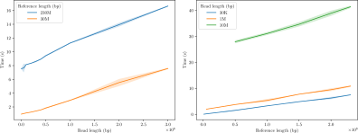

# Single Nucleotide Polymorphism finder

Given a reference nucleotide sequence $R$ and a long read $r$, this algorithm finds - if it does exist - the position $i$ on $r$ such that $r$ matches a substring of $R$, except for $r_i$.

This solution was built on top of the concept of **Spaced Seed**.

## Compilation
1. Install [unordered_dense](https://github.com/martinus/unordered_dense);
2. compile [ntHash](https://github.com/bcgsc/ntHash) by setting as prefix the root of the repository (see ntHash docs for further information);
3. run the following:
   ```bash
   mkdir build and cd build
   cmake -DCMAKE_BUILD_TYPE=Release ../
   make
   ```

## Usage

```bash
./spacedSeeds run <reference FASTA> <read FASTA>
```

There are some optional arguments which can be used to set custom parameters:
* `--k` sets the length of the spaced seeds in the second phase of the algorithm
* `--firstK` sets the length of the exact k-mers which will be extracted during the first part of the algorithm
* `--bloomFilterThreshold` sets the probability of the bloom filter of encountering a false positive
* `--firstThreshold` sets the threshold under which the areas are not taken into account for the second part of the algorithm.


## How does it work
The algorithm is designed to follow these steps:
1. **Approximate identification of possible areas of match**. This step is crucial for the algorithm performance, since it allows to exclude almost all of $R$ from the next step, improving drastically the speed on real data, requiring much less memory and time. It makes use of a bloom filter containing informations on the existence or not of the $R$ exact $k$-$mers$. This step requires $\mathcal{O}(|R|)$ time. In more detail, it proceeds as follows:
    1.  $R$ is split into subsequences of length $\left\lceil \frac{|r|}{2} \right\rceil$
    2.  Construction of a bloom filter containing the exact $k$-$mers$ $K_r$ of $r$
    3. For each partition $p$ of $R$ with exact k-mers $K_p$ compute $\textrm{sim}(b, r) = \frac{|  K_p \cap K_r  |}{|K_p|}$ and decide if consider it as a candidate partition by using a threshold $\tau$.
2. **Matching between $r$ and the candidate areas of $R$**. At this moment, each candidate partition is considered until a match is found. More specifically, the algorithm works as follows:
    1. Extraction of the spaced seeds of $r$. Not all the possible seeds are requested to be saved since they would represent redundant information, so only the ones having the "do not care" symbol are considered for the extraction, except for the last $k$ ones, which are needed.
    2. Construction of an index for $r$
    3. For each partition $i$ of $R$ with similarity $\geq \tau$, consider also the adjacent ones and construct an index, then use it for comparing the matching positions of the spaced seeds. Note that only the spaced seeds in common with $r$ are saved in the index. Moreover, the match visits the seeds from the least frequent in $i$ to the most frequent.


<div style="text-align: center;">
  


  <figcaption>Overall structure of the indices used during the matching phase.</figcaption>
</div>

## Benchmarks 

<div style="text-align: center;">
  
  <figcaption>Benchmarks with match.</figcaption>
</div>
<br/><br/><br/>
<div style="text-align: center;">
  
  <figcaption>Benchmarks without match.</figcaption>
</div>

## Credits

* [ntHash](https://github.com/bcgsc/ntHash)
* [bloom](https://github.com/ArashPartow/bloom)
* [unordered_dense](https://github.com/martinus/unordered_dense)